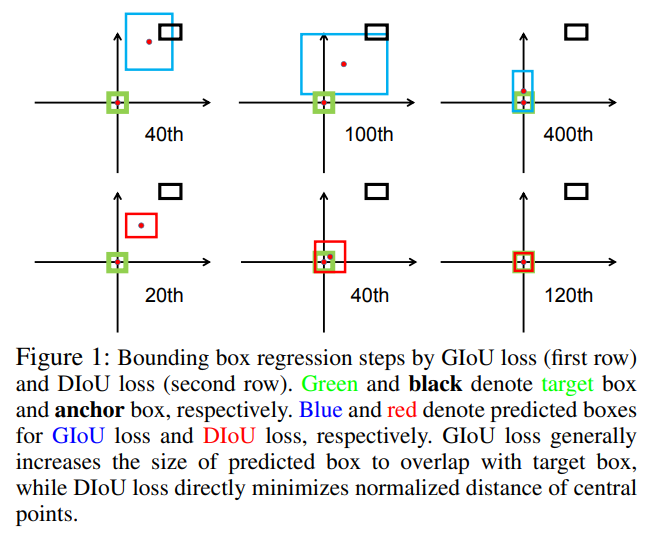
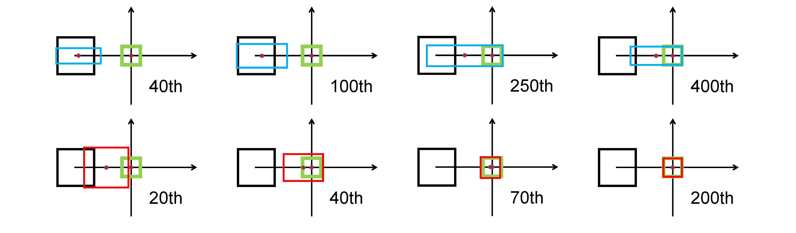
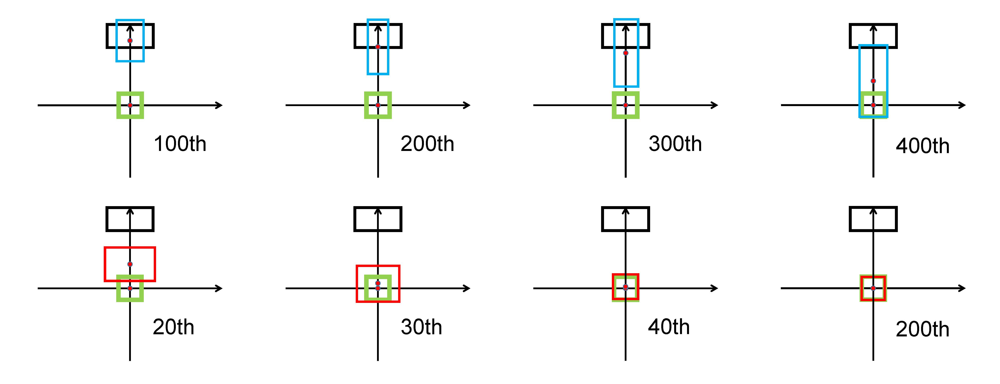

# Distance-IoU Loss: Faster and Better Learning for Bounding Box Regression (DIoU)

## Comparision between GIoU and DIoU

In the paper, the author provides three typical cases in simulation experiments:

First, the anchor box is set at a diagonal orientation. GIoU loss tends to increase the size of the predicted box to overlap with the target box, while DIoU loss directly minimizes the normalized distance of centre points

    

Second, the anchor box is set at the horizontal orientation. GIoU loss broadens the right edge of the predicted box to overlap with the target box, while the central point only moves slightly towards the target box. On $th$ other hand, from the result at $T=400$, GIoU loss has totally degraded to IoU loss, while DIoU loss only at $T=120$

    

Third, the anchor box is set at the vertical orientation. Similarly, GIoU loss broadens the bottom edge of the predicted box to overlap with the target box and these two boxes do not match in the final iteration.

    

To minimize the normalized distance between the central points of two bounding boxes, the penalty term can be defined as 

$$R_{DIoU}=\frac{\rho^2 (b, b^{gt})}{c^2}$$
where $b$ and $b^{gt}$ denote the central points of $B$ and $B^{gt}$, $\rho(.)$ is the Euclidean distance, and $c$ is the diagonal length of the smallest enclosing box covering the two boxes. Then the DIoU loss function can be defined as

$$L_{DIoU}=1 - IoU + \frac{\rho^2 (b, b^{gt})}{c^2}$$

## Experiments

|Backbone|mAP|mAP50|mAP75|
|--|--|--|--|
|ResNet34||||
| ResNet34 + GIoU| 41.2| 64.5 | 44.0 | 
| ResNet34 + DIoU| 42.0| 64.8 | 44.8 |

## References
+ https://github.com/Zzh-tju/DIoU
+ https://arxiv.org/pdf/1911.08287.pdf
