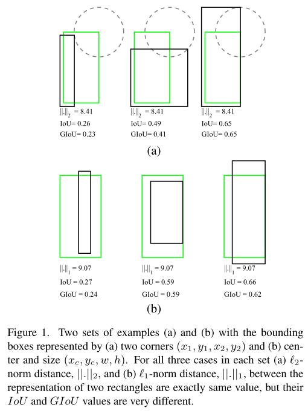

<head>
    
</head>

# Generalized Intersect over Union (GIoU)

Object Detection consists of two sub-tasks: Object localization and object classification. The common goal of object localization is to determize coordinates of bounding boxes where are in the picture.

Intersection over Union (IoU) is the metric measure to evaluate the accuracy of object detection model.

$$IoU = \frac{A \cap B}{A \cup B} = \frac{I}{U}$$

The IoU value is computed based on ground-truth box and predicted box. During training model, the cost function is usually optimized to return the best of predicted box and compute IoU to evaluate model. The common cost functions are l1-norm distance or l2-norm distance. 

<figure>
    
    <figcaption align='center'>There is no strong relation between the loss optimization and improving IoU values</figcaption>
</figure>

Generalized version of IoU can be directly used as the objective function to optimize in the object detection problem. When IoU does not reflect if two shapes are in vicinity of each other or very far from each other.
